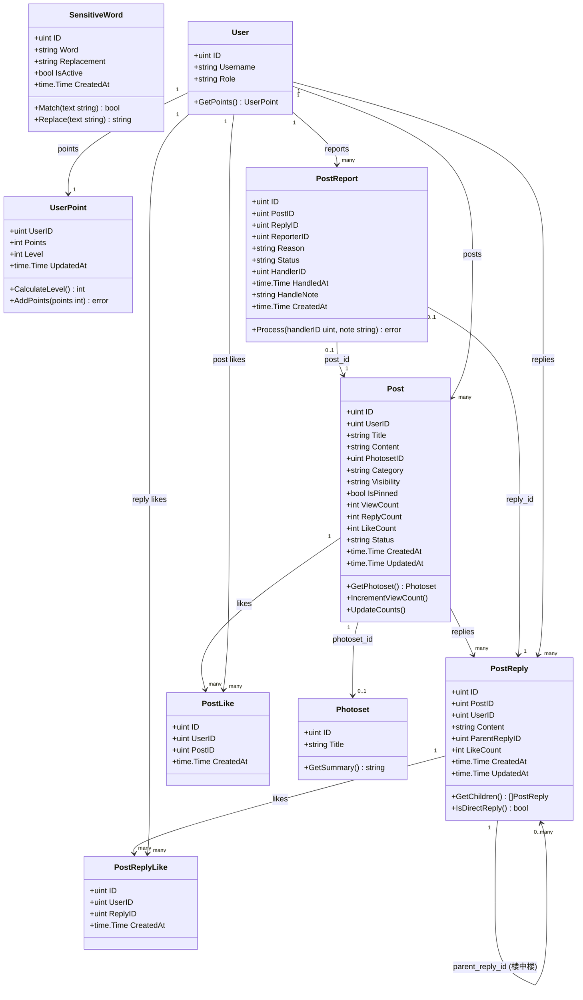
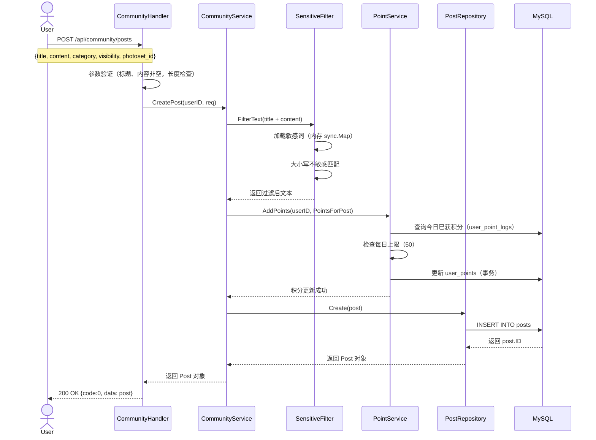
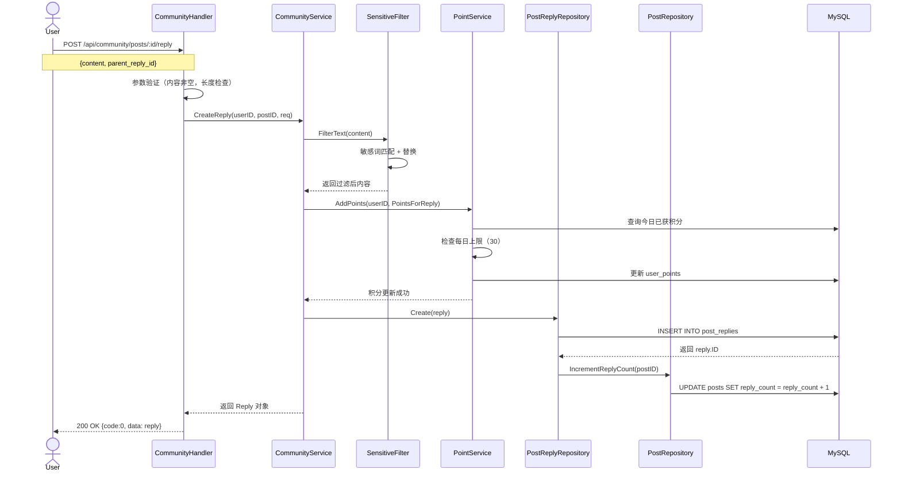
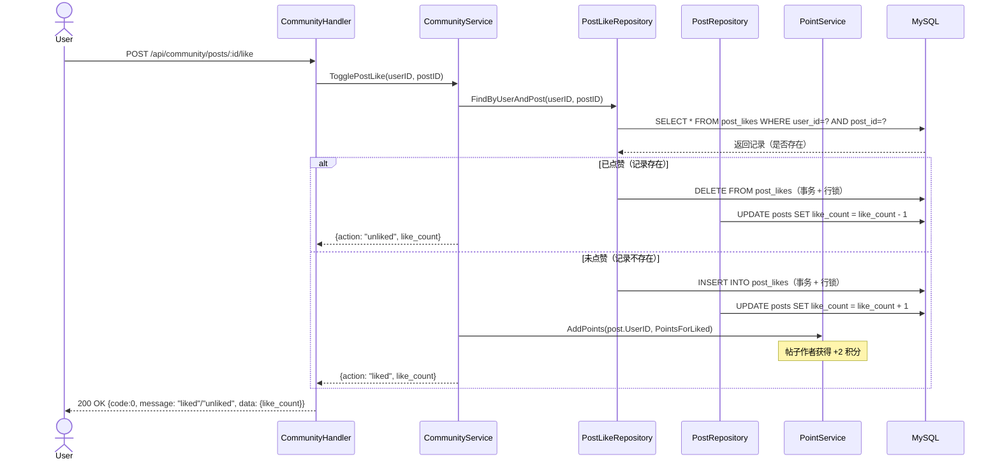
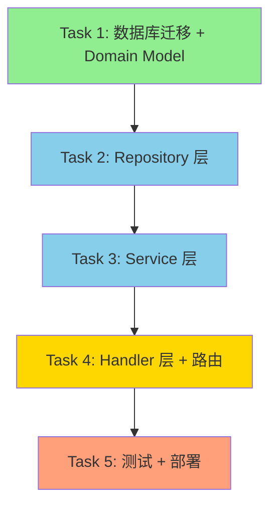

# PhotoSet 社区功能 — 系统架构设计 + 任务分解

> 版本：v1.0
> 日期：2026-05-24
> 架构师：高见远（Gao）
> 状态：待开发

---

## 第一部分：系统设计

### 1. 实现方案 + 框架选型

#### 技术栈确认

基于现有项目技术栈，确认使用以下框架（**无需额外引入新框架**）：

| 技术层 | 框架/库 | 版本 | 用途 |
|--------|----------|------|------|
| Web 框架 | Gin | ^1.9 | HTTP 路由、中间件、参数绑定 |
| ORM | GORM | ^1.25 | 数据库操作、模型定义、迁移 |
| 数据库 | MySQL | 8.0+ | 数据持久化 |
| 语言 | Go | ^1.21 | 后端开发语言 |

#### 架构模式

采用 **三层架构**（符合现有项目结构）：

```
┌─────────────────────────────────────┐
│   Handler 层 (internal/http/handlers) │  ← HTTP 请求处理、参数验证、响应封装
├─────────────────────────────────────┤
│   Service 层 (internal/service)      │  ← 业务逻辑、敏感词过滤、积分计算
├─────────────────────────────────────┤
│ Repository 层 (internal/repository)  │  ← 数据库操作、数据访问
└─────────────────────────────────────┘
             ↓
         MySQL Database
```

#### 核心设计决策

1. **敏感词过滤**
   - 启动時从数据库加载所有 `is_active=true` 的敏感词到内存（sync.Map）
   - 提供 HTTP 接口供管理员操作后立即热加载（无需重启）
   - 匹配算法：大小写不敏感，精确匹配（v1），后续可扩展为 Trie 树

2. **积分计算**
   - 使用 Redis 或数据库记录每日积分行为（防止超出每日上限）
   - 积分变更在事务中完成，保证一致性
   - 等级根据积分实时计算（无需额外字段维护）

3. **点赞 Toggle 逻辑**
   - 使用数据库事务 + 行锁（SELECT ... FOR UPDATE）
   - 先查询是否已有记录 → 有则删除（取消点赞），无则插入（点赞）
   - 同时更新对应计数子段

4. **可见性过滤**
   - Handler 层根据当前用户角色（从 JWT 解析）过滤 `visibility` 条件
   - 未登录用户：只返回 `visibility=public`
   - 登录用户：根据 `user.role` 过滤

5. **计数同步**
   - 每次相关操作（点赞、回帖）在事务中同步更新计数子段
   - 提供修复脚本（可选定时任务）处理不一致情况

---

### 2. 文件列表及相对路径

#### 2.1 数据库迁移

| 文件路径 | 说明 |
|----------|------|
| `migrations/add_community_tables.sql` | 社区模块所有表的创建 SQL（含索引、初始敏感词） |

#### 2.2 Domain Model 层

| 文件路径 | 说明 |
|----------|------|
| `internal/domain/post.go` | Post 模型定义 + 输入验证 |
| `internal/domain/post_reply.go` | PostReply 模型定义 + 输入验证 |
| `internal/domain/post_like.go` | PostLike 模型定义（隐式，可嵌入 post.go） |
| `internal/domain/post_reply_like.go` | PostReplyLike 模型定义（隐式，可嵌入 post_reply.go） |
| `internal/domain/user_point.go` | UserPoint 模型定义 + 等级计算 |
| `internal/domain/sensitive_word.go` | SensitiveWord 模型定义 |
| `internal/domain/post_report.go` | PostReport 模型定义 |

#### 2.3 Repository 层

| 文件路径 | 说明 |
|----------|------|
| `internal/repository/post_repository.go` | 帖子数据库操作（CRUD + 计数更新） |
| `internal/repository/post_reply_repository.go` | 回帖数据库操作 |
| `internal/repository/post_like_repository.go` | 点赞记录操作 |
| `internal/repository/post_reply_like_repository.go` | 回帖点赞记录操作 |
| `internal/repository/user_point_repository.go` | 用户积分操作 |
| `internal/repository/sensitive_word_repository.go` | 敏感词操作 |
| `internal/repository/post_report_repository.go` | 举报记录操作 |

#### 2.4 Service 层

| 文件路径 | 说明 |
|----------|------|
| `internal/service/community_service.go` | 社区核心业务逻辑（发帖、回帖、点赞、举报） |
| `internal/service/sensitive_filter.go` | 敏感词加载 + 过滤逻辑 |
| `internal/service/point_service.go` | 积分增减 + 每日上限检查 + 等级计算 |
| `internal/service/hot_posts_service.go` | 热门帖子算法 |

#### 2.5 Handler 层

| 文件路径 | 说明 |
|----------|------|
| `internal/http/handlers/community_handler.go` | 社区公开 API Handler |
| `internal/http/handlers/admin/community_handler.go` | 管理后台 API Handler |

#### 2.6 路由注册

| 文件路径 | 说明 |
|----------|------|
| `internal/http/routes/community_routes.go` | 社区模块路由注册 |

#### 2.7 配置文件（如需要）

| 文件路径 | 说明 |
|----------|------|
| `config/community.yaml` | 社区模块配置（如敏感词热加载间隔） |

#### 文件总数统计

- **新增文件**：约 20 个
- **修改文件**：`cmd/server/main.go`（注册路由）、`internal/http/routes.go`（引入社区路由）

---

### 3. 数据结构和接口（类图）



**关联关系说明：**

1. **Post ↔ Photoset**：可选关联（photoset_id 可空），社区帖子和套图完全独立
2. **Post ↔ PostReply**：一对多，回帖属于某个帖子
3. **PostReply ↔ PostReply**：自关联（parent_reply_id），支持楼中楼
4. **Post ↔ PostLike**：一对多，记录点赞用户
5. **PostReply ↔ PostReplyLike**：一对多，记录回帖点赞用户
6. **User ↔ UserPoint**：一对一，用户积分/等级
7. **PostReport ↔ Post / PostReply**：二选一外键，举报对象

---

### 4. 程序调用流程（时序图）

#### 4.1 发帖流程



#### 4.2 回帖流程



#### 4.3 点赞帖子流程（Toggle）



---

### 5. 依赖包列表

#### 5.1 新增 Go 包

本项目基于现有 Go + Gin + GORM 技术栈，**无需额外引入新包**。

如果 `sensitive_words` 表数据量较大（>1000 条），可考虑引入 Trie 树包优化匹配性能（可选）：

```
# 可选（v2 优化用）
github.com/anknown/ahocorasick @ latest  # Aho-Corasick 多模式匹配算法
```

#### 5.2 现有依赖确认

确保 `go.mod` 中已包含以下依赖（如未安装需执行 `go get`）：

```
github.com/gin-gonic/gin @ ^1.9
gorm.io/gorm @ ^1.25
gorm.io/driver/mysql @ ^1.5
github.com/golang-jwt/jwt/v5 @ ^5.0  # JWT 认证（如已用）
```

---

### 6. 共享知识（跨文件约定）

#### 6.1 敏感词热加载方式

**目标**：管理员通过后台增删改敏感词后，无需重启服务即可生效。

**实现方案**：

1. **内存存储**：使用 `sync.Map` 或 `atomic.Value` 存储敏感词列表（转为小写）
2. **热加载触发方式**（二选一）：
   - **方式 A（推荐）**：提供管理后台 HTTP 接口 `PUT /api/admin/community/keywords/reload`，手动触发重新加载
   - **方式 B**：敏感词增删改接口执行成功后，自动调用加载函数（函数内部加锁，防止并发）
3. **加载函数** `LoadSensitiveWords()`：
   - 从 `sensitive_words` 表查询所有 `is_active=true` 的记录
   - 转为小写后存入 `sync.Map`
   - 服务启动时自动调用一次

**代码示例**（参考）：

```go
var sensitiveWords sync.Map // key: word (lowercase), value: replacement

func LoadSensitiveWords(db *gorm.DB) error {
    var words []SensitiveWord
    if err := db.Where("is_active = ?", true).Find(&words).Error; err != nil {
        return err
    }
    newMap := sync.Map{}
    for _, w := range words {
        newMap.Store(strings.ToLower(w.Word), w.Replacement)
    }
    sensitiveWords = newMap // atomic swap
    return nil
}
```

#### 6.2 积分计算规则

**积分获取方式**：

| 行为 | 积分值 | 每日上限 | 说明 |
|------|--------|----------|------|
| 发帖 | +10 | 50 | 每篇 +10，每日最多 5 篇 |
| 回帖 | +5 | 30 | 每帖 +5，每日最多 6 条 |
| 帖子被点赞 | +2 | 无 | 每次被点赞 +2 |
| 回帖被点赞 | +1 | 无 | 每次被点赞 +1 |
| 帖子被删除（违规） | -20 | 无 | 管理员删除时扣除 |

**每日上限实现方式**：

1. **方案 A（推荐）**：使用 `user_point_logs` 表记录每次积分变更（含 `created_at` 日期），查询当日已获积分总和
2. **方案 B**：使用 Redis 缓存当日积分（`key: user:point:date:userID`, `expire: 当天 23:59:59`）

**等级计算函数**（实时计算，无需存数据库）：

```go
func CalculateLevel(points int) int {
    thresholds := []int{0, 100, 500, 2000, 5000, 10000, 20000, 30000, 40000, 50000}
    for i := len(thresholds) - 1; i >= 0; i-- {
        if points >= thresholds[i] {
            return i + 1 // 等级从 1 开始
        }
    }
    return 1
}
```

#### 6.3 可见性过滤逻辑

**过滤时机**：在 Handler 层或 Service 层构建 SQL 查询条件时动态添加 `visibility` 过滤。

**规则**：

| 用户状态 | visibility 条件 | 说明 |
|----------|-----------------|------|
| 未登录 | `visibility = 'public'` | 只能看公开帖子 |
| 登录，role=member | `visibility IN ('public', 'member')` | 可看公开 + 会员 |
| 登录，role=vip | `visibility IN ('public', 'member', 'vip')` | 可看公开 + 会员 + VIP |
| 登录，role=admin | 无限制 | 可看所有 |
| 管理员查看后台 | 无限制 | 可看所有状态（含 pending/rejected） |

**实现代码示例**（Service 层）：

```go
func (s *CommunityService) GetPosts(user *User, filters ...) ([]Post, error) {
    query := s.db.Model(&Post{}).Where("status = ?", "approved")

    if user == nil {
        query = query.Where("visibility = ?", "public")
    } else if user.Role == "member" {
        query = query.Where("visibility IN (?, ?)", "public", "member")
    } else if user.Role == "vip" {
        query = query.Where("visibility IN (?, ?, ?)", "public", "member", "vip")
    }
    // admin: no visibility filter

    // ... pagination, ordering, etc.
}
```

#### 6.4 计数字段同步保证

**原则**：计数字段（`like_count`, `reply_count`）与真实记录数保持一致。

**实现方式**：

1. **点赞/取消点赞**：在事务中同时操作 `post_likes` 表和 `posts.like_count` 字段
2. **回帖**：在事务中同时插入 `post_replies` 记录和更新 `posts.reply_count`
3. **删除回帖**（管理员）：在事务中同时删除 `post_replies` 记录 and 更新 `posts.reply_count`

**修复脚本**（可选）：

```sql
-- 修复 posts.like_count
UPDATE posts p
SET like_count = (SELECT COUNT(*) FROM post_likes WHERE post_id = p.id);

-- 修复 posts.reply_count
UPDATE posts p
SET reply_count = (SELECT COUNT(*) FROM post_replies WHERE post_id = p.id);

-- 修复 post_replies.like_count
UPDATE post_replies r
SET like_count = (SELECT COUNT(*) FROM post_reply_likes WHERE reply_id = r.id);
```

---

### 7. 待明确事项

以下事项需要产品经理（许清楚）或技术负责人确认：

| # | 问题 | 建议方案 | 状态 |
|---|------|----------|------|
| 1 | **楼中楼深度限制** — 是否限制楼中楼深度（建议：最多 3 层）？ | 建议限制 3 层，避免无限递归 | ❓ 待确认 |
| 2 | **帖子删除方式** — 硬删除还是软删除（标记删除）？ | 建议：管理员硬删除，普通用户 v2 才能删除 | ❓ 待确认 |
| 3 | **每日上限存储** — 使用 `user_point_logs` 表还是 Redis？ | 建议用 `user_point_logs` 表（无需引入 Redis 依赖） | ❓ 待确认 |
| 4 | **热门帖子算法** — 时间衰减具体公式？（当前：`(reply_count * 2 + like_count + view_count / 10)`，7 天内） | 建议：仅对 7 天内帖子应用此公式，超过 7 天按普通排序 | ✅ 已确认 |
| 5 | **敏感词匹配算法** — v1 精确匹配还是模糊匹配（包含即可）？ | 建议 v1 精确匹配（完整单词匹配），v2 做模糊匹配 | ✅ 已确认（v1 精确匹配） |
| 6 | **积分是否可以为负** — PRD 说最低 -9999，但是否允许？ | 建议允许为负，但等级最低为 L1 | ✅ 已确认 |
| 7 | **举报后是否通知被举报人** — v1 不做消息通知，但是否需要？ | 建议 v1 不通知，v2 做消息通知 | ❓ 待确认（v1 不做） |

---

## 第二部分：任务分解

### 8. 任务列表（按依赖顺序排列）

> **约束说明**：
> - 最大任务数：5 个（硬性上限）
> - 最小粒度：每个任务至少包含 3 个相关文件
> - 分组原则：按功能模块/层次分组

---

#### ✅ Task 1：数据库迁移 + Domain Model（基础层）

**任务说明**：创建数据库迁移 SQL + 所有 Domain Model 定义（含 GORM 标签、输入验证）

**源文件**（8 个）：

| 文件路径 | 说明 |
|----------|------|
| `migrations/add_community_tables.sql` | 建表 SQL（7 张表 + 索引 + 初始敏感词） |
| `internal/domain/post.go` | Post 模型 + 验证 |
| `internal/domain/post_reply.go` | PostReply 模型 + 验证 |
| `internal/domain/user_point.go` | UserPoint 模型 + 等级计算 |
| `internal/domain/sensitive_word.go` | SensitiveWord 模型 |
| `internal/domain/post_report.go` | PostReport 模型 |
| `internal/domain/post_like.go` | PostLike 模型（可嵌入 post.go） |
| `internal/domain/post_reply_like.go` | PostReplyLike 模型（可嵌入 post_reply.go） |

**依赖**：无（第一个任务）

**优先级**：P0

**验收标准**：
- [ ] SQL 文件可以成功执行（创建所有表 + 索引）
- [ ] Go Model 文件编译通过（无语法错误）
- [ ] 输入验证函数正确拒绝非法输入

---

#### ✅ Task 2：Repository 层（数据访问层）

**任务说明**：实现所有数据库操作函数（CRUD + 计数更新 + 事务处理）

**源文件**（7 个）：

| 文件路径 | 说明 |
|----------|------|
| `internal/repository/post_repository.go` | 帖子 CRUD + 计数更新 |
| `internal/repository/post_reply_repository.go` | 回帖 CRUD + 树形结构查询 |
| `internal/repository/post_like_repository.go` | 点赞记录操作（toggle 查询） |
| `internal/repository/post_reply_like_repository.go` | 回帖点赞记录操作 |
| `internal/repository/user_point_repository.go` | 用户积分操作 + 日志 |
| `internal/repository/sensitive_word_repository.go` | 敏感词 CRUD + 热加载查询 |
| `internal/repository/post_report_repository.go` | 举报记录 CRUD + 处理 |

**依赖**：Task 1（Domain Model 定义完成）

**优先级**：P0

**验收标准**：
- [ ] 所有 Repository 文件编译通过
- [ ] 数据库操作函数在事务中正确执行
- [ ] 计数更新与记录操作保持一致性

---

#### ✅ Task 3：Service 层（业务逻辑层）

**任务说明**：实现核心业务逻辑（敏感词过滤、积分计算、热门帖子算法、可见性过滤）

**源文件**（4 个）：

| 文件路径 | 说明 |
|----------|------|
| `internal/service/community_service.go` | 核心业务（发帖、回帖、点赞、举报） |
| `internal/service/sensitive_filter.go` | 敏感词加载 + 过滤逻辑（含热加载） |
| `internal/service/point_service.go` | 积分增减 + 每日上限检查 + 等级计算 |
| `internal/service/hot_posts_service.go` | 热门帖子算法（时间衰减） |

**依赖**：Task 1 + Task 2（Model + Repository 完成）

**优先级**：P0

**验收标准**：
- [ ] 敏感词过滤正确替换（大小写不敏感）
- [ ] 积分计算正确（含每日上限）
- [ ] 点赞 toggle 逻辑正确（并发安全）
- [ ] 热门帖子排序符合算法

---

#### ✅ Task 4：Handler 层 + 路由注册（接口层）

**任务说明**：实现所有 HTTP Handler + 路由注册（公开 API + 管理后台 API）

**源文件**（3 个）：

| 文件路径 | 说明 |
|----------|------|
| `internal/http/handlers/community_handler.go` | 公开 API Handler（12 个接口） |
| `internal/http/handlers/admin/community_handler.go` | 管理后台 API Handler（13 个接口） |
| `internal/http/routes/community_routes.go` | 路由注册 |

**修改文件**（2 个）：

| 文件路径 | 说明 |
|----------|------|
| `cmd/server/main.go` | 注册社区路由 |
| `internal/http/routes.go` | 引入社区路由模块 |

**依赖**：Task 3（Service 层完成）

**优先级**：P1

**验收标准**：
- [ ] 所有 API 接口可以正常访问
- [ ] 参数验证正确（返回 400 错误）
- [ ] 权限控制正确（未登录 vs 登录 vs 管理员）
- [ ] 响应格式统一 `{code, data, message}`

---

#### ✅ Task 5：测试 + 部署（质量保证）

**任务说明**：编写单元测试 + 集成测试 + 编译验证 + 部署脚本

**源文件**（6 个）：

| 文件路径 | 说明 |
|----------|------|
| `internal/service/community_service_test.go` | Service 层单元测试 |
| `internal/service/sensitive_filter_test.go` | 敏感词过滤测试 |
| `internal/service/point_service_test.go` | 积分计算测试 |
| `internal/http/handlers/community_handler_test.go` | Handler 层集成测试 |
| `scripts/test_community.sh` | 测试脚本（可选） |
| `docs/community_api_test_cases.md` | API 测试用例文档 |

**依赖**：Task 4（Handler + 路由完成）

**优先级**：P1

**验收标准**：
- [ ] 单元测试覆盖率 > 70%
- [ ] 集成测试通过（使用 `gin.CreateTestContext`）
- [ ] 编译成功（`go build`）
- [ ] 部署到测试环境成功

---

### 9. 任务依赖关系图



**说明**：
- **T1 → T2 → T3 → T4 → T5**：线性依赖，必须按顺序完成
- **T1** 是基础（P0），完成后可并行开发 T2 和 T3 的单元测试（可选）
- **T4** 完成后可邀请前端（App）联调
- **T5** 是质量保障，必须在上线前完成

---

## 第三部分：附录

### 10. API 接口清单（供工程师参考）

#### 10.1 公开 API（需登录态，部分支持匿名）

| 方法 | 路径 | Handler 函数 | 说明 |
|------|------|--------------|------|
| GET | `/api/community/posts` | `GetPosts` | 帖子列表（分页、分类、排序） |
| GET | `/api/community/posts/:id` | `GetPostDetail` | 帖子详情 + 浏览+1 |
| GET | `/api/community/posts/:id/replies` | `GetReplies` | 回帖列表（树形结构） |
| POST | `/api/community/posts` | `CreatePost` | 发帖 |
| POST | `/api/community/posts/:id/reply` | `CreateReply` | 回帖 |
| POST | `/api/community/posts/:id/like` | `TogglePostLike` | 点赞帖子（toggle） |
| POST | `/api/community/replies/:id/like` | `ToggleReplyLike` | 点赞回帖（toggle） |
| POST | `/api/community/posts/:id/report` | `ReportPost` | 举报帖子 |
| POST | `/api/community/replies/:id/report` | `ReportReply` | 举报回帖 |
| GET | `/api/community/categories` | `GetCategories` | 分类列表 |
| GET | `/api/community/hot` | `GetHotPosts` | 热门帖子 |
| GET | `/api/community/me/posts` | `GetMyPosts` | 我的帖子 |
| GET | `/api/community/me/replies` | `GetMyReplies` | 我的回帖 |
| GET | `/api/community/me/points` | `GetMyPoints` | 我的积分 |

#### 10.2 管理后台 API（admin 权限）

| 方法 | 路径 | Handler 函数 | 说明 |
|------|------|--------------|------|
| GET | `/api/admin/community/posts` | `AdminGetPosts` | 帖子列表（含状态筛选） |
| PUT | `/api/admin/community/posts/:id/pin` | `AdminTogglePin` | 置顶/取消置顶 |
| PUT | `/api/admin/community/posts/:id/status` | `AdminUpdateStatus` | 修改状态 |
| DELETE | `/api/admin/community/posts/:id` | `AdminDeletePost` | 删除帖子 |
| GET | `/api/admin/community/replies` | `AdminGetReplies` | 回帖列表 |
| DELETE | `/api/admin/community/replies/:id` | `AdminDeleteReply` | 删除回帖 |
| GET | `/api/admin/community/keywords` | `AdminGetKeywords` | 敏感词列表 |
| POST | `/api/admin/community/keywords` | `AdminAddKeyword` | 添加敏感词 |
| PUT | `/api/admin/community/keywords/:id` | `AdminUpdateKeyword` | 修改敏感词 |
| DELETE | `/api/admin/community/keywords/:id` | `AdminDeleteKeyword` | 删除敏感词 |
| PUT | `/api/admin/community/keywords/reload` | `AdminReloadKeywords` | 热加载敏感词 |
| GET | `/api/admin/community/reports` | `AdminGetReports` | 举报列表 |
| PUT | `/api/admin/community/reports/:id/resolve` | `AdminResolveReport` | 处理举报 |
| GET | `/api/admin/community/users` | `AdminGetUsers` | 用户积分列表 |
| PUT | `/api/admin/community/users/:id/points` | `AdminAdjustPoints` | 调整用户积分 |
| GET | `/api/admin/community/stats` | `AdminGetStats` | 社区数据统计 |

---

### 11. 开发注意事项

#### 11.1 事务处理

以下操作**必须**在数据库事务中完成（使用 GORM 的 `db.Transaction`）：

1. **发帖**：插入 `posts` + 更新 `user_points`
2. **回帖**：插入 `post_replies` + 更新 `posts.reply_count` + 更新 `user_points`
3. **点赞帖子（toggle）**：插入/删除 `post_likes` + 更新 `posts.like_count` + （点赞时）更新作者 `user_points`
4. **点赞回帖（toggle）**：插入/删除 `post_reply_likes` + 更新 `post_replies.like_count` + （点赞时）更新作者 `user_points`
5. **删除帖子（管理员）**：删除 `posts` + 删除关联 `post_replies`/`post_likes`/`post_reports` + 更新作者 `user_points`（扣除）
6. **删除回帖（管理员）**：删除 `post_replies` + 更新 `posts.reply_count`

#### 11.2 并发控制

以下场景需要使用数据库行锁（`SELECT ... FOR UPDATE` 或 GORM 的 `Clauses(clause.Locking{Strength: "UPDATE"})`）：

1. **点赞 toggle**：查询 `post_likes` 记录时锁住相关行，防止并发重复插入
2. **更新计数字段**：更新 `like_count`/`reply_count` 时锁住对应记录

#### 11.3 错误处理

统一错误响应格式：

```json
{
  "code": 40001,
  "message": "标题不能为空",
  "data": null
}
```

常见错误码：

| 错误码 | 说明 |
|--------|------|
| 40001 | 参数验证失败 |
| 40002 | 每日积分上限已达 |
| 40301 | 权限不足（需要登录） |
| 40302 | 权限不足（需要管理员） |
| 40401 | 帖子不存在 |
| 40402 | 回帖不存在 |
| 50001 | 数据库操作失败 |
| 50002 | 敏感词加载失败 |

---

### 12. 上线检查清单

- [ ] 数据库迁移 SQL 在测试环境执行成功
- [ ] 敏感词初始数据已导入（建议 50 个常见敏感词）
- [ ] 所有 API 接口通过 Postman 测试
- [ ] 积分计算逻辑验证（含每日上限）
- [ ] 敏感词过滤验证（大小写不敏感、替换正确）
- [ ] 点赞 toggle 逻辑验证（并发测试）
- [ ] 权限控制验证（未登录、登录用户、管理员）
- [ ] 热门帖子算法验证（时间衰减）
- [ ] 枚举值约束已添加（`category`, `visibility`, `status` 等）
- [ ] 数据库索引已创建（查询性能）
- [ ] 日志输出正常（敏感词加载、积分变更等关键操作）
- [ ] 编译通过（`go build`）
- [ ] 部署到测试环境成功

---

**架构设计完成，可提交给工程师开发。**

---

*作者：高见远（Gao）*
*日期：2026-05-24*
*版本：v1.0*
